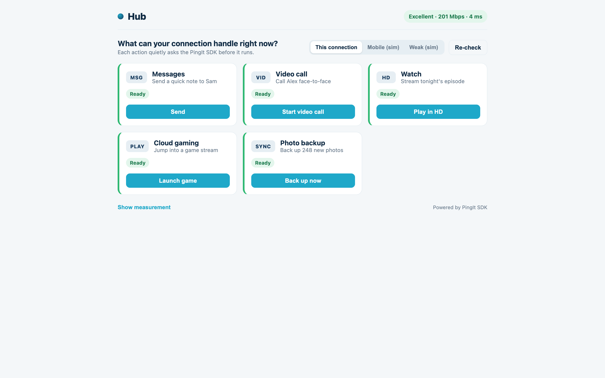
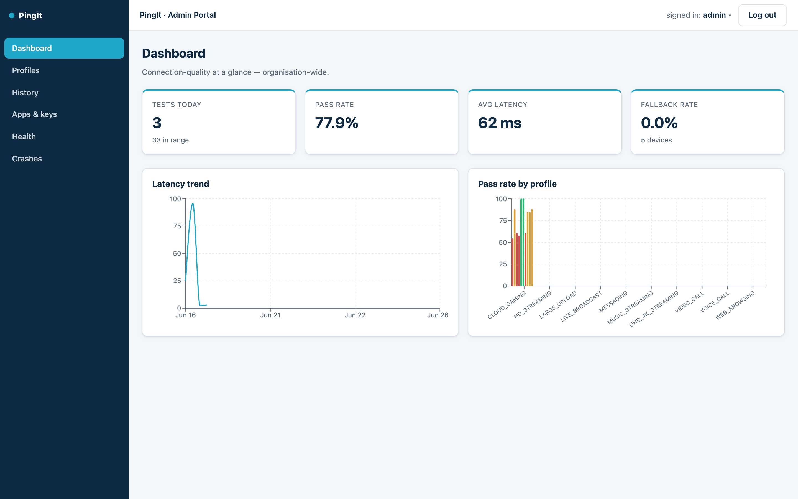
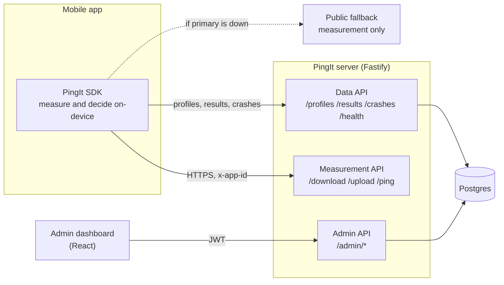
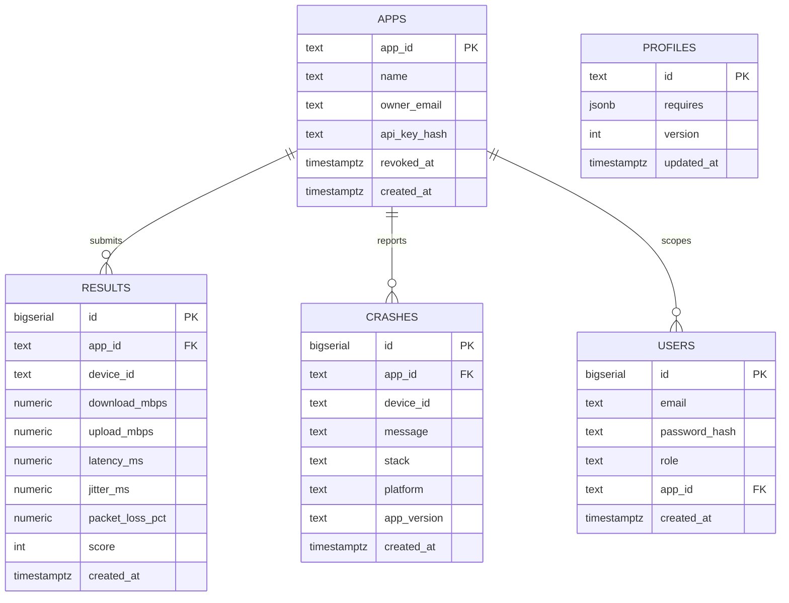
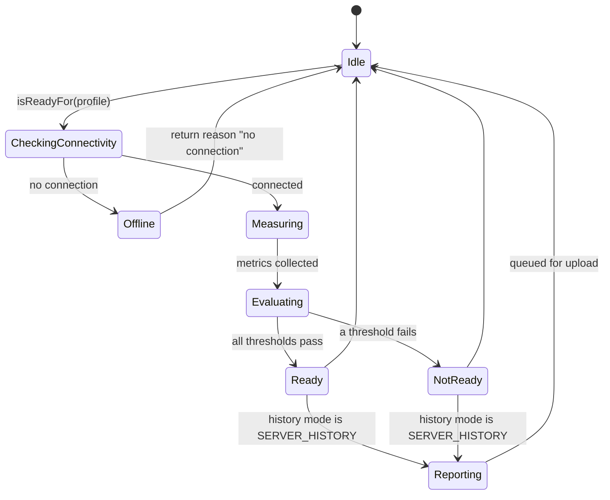
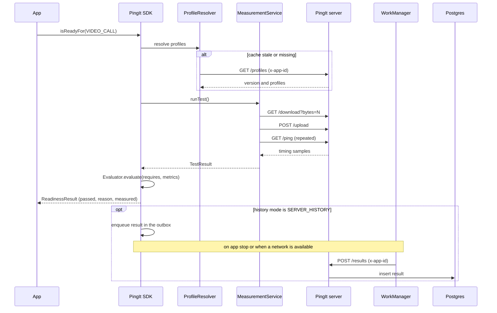

# PingIt SDK

PingIt is a lightweight mobile SDK that measures the quality of a device's
internet connection (download, upload, latency, and jitter) and answers a
practical question for the app: is the connection good enough for what the user
is about to do? Instead of forcing developers to interpret raw numbers, the SDK
maps a measurement to named readiness profiles such as `VIDEO_CALL` or
`HD_STREAMING` and returns a clear pass or fail with a reason.

The project has three parts:

- An **Android SDK** (Kotlin) that runs the measurement and makes the decision on
  the device.
- A **measurement server** (Node and Fastify, backed by Postgres) that serves as
  the test target and stores readiness profiles and optional history.
- An **admin dashboard** (React) for managing apps, tuning profiles, and viewing
  analytics.

The SDK initializes itself on app startup, keeps network use small, and continues
to work when the primary server is unreachable.

## Features

- Connection measurement: download and upload throughput, latency, and jitter.
- Readiness profiles: a curated set of use cases (messaging, voice call, video
  call, HD and 4K streaming, cloud gaming, live broadcast, large upload) with
  tunable thresholds.
- On-device decision: `isReadyFor(profile)` returns pass or fail plus the reason,
  with no server round trip required to decide.
- Auto initialization: the SDK starts itself from manifest configuration using
  AndroidX App Startup. Manual initialization is also supported.
- Configurable history: keep nothing, keep the last result on the device, or send
  results to the server for trends.
- Resilience: a public measurement endpoint is used as a fallback, and an honest
  offline result is returned when there is no connection.
- Crash capture: uncaught exceptions are persisted on the device and uploaded on
  the next launch.
- Server-tuned thresholds: profiles are versioned in the database and edited from
  the dashboard, so changes reach clients without an app release.

## Visuals

A demo app using the SDK (the "Hub"), and the SDK dashboard:




Video demonstration:

<!-- Replace with a link to the recorded walkthrough. -->
[Watch the demonstration](docs/assets/demo-video.mp4)

## Data Structures

A measurement result submitted by the SDK (`POST /results`) and returned by
`GET /results`:

```json
{
  "id": 42,
  "appId": "app_demo",
  "deviceId": "8f1c2a90-3b6e-4f0d-9d1a-2b7c4e5f6a01",
  "downloadMbps": 45.2,
  "uploadMbps": 12.8,
  "latencyMs": 18.5,
  "jitterMs": 2.1,
  "packetLossPct": 0,
  "score": 87,
  "createdAt": "2026-06-17T15:30:45.123Z"
}
```

A readiness profile from `GET /profiles` (thresholds are tunable server-side):

```json
{
  "version": 1,
  "profiles": [
    {
      "id": "VIDEO_CALL",
      "requires": {
        "downloadMbps": { "min": 1.5 },
        "uploadMbps": { "min": 1.0 },
        "latencyMs": { "max": 200 },
        "jitterMs": { "max": 40 },
        "packetLossPct": { "max": 3 }
      }
    }
  ]
}
```

Postgres schema (the two central tables):

```sql
CREATE TABLE profiles (
  id          text PRIMARY KEY,           -- e.g. VIDEO_CALL
  requires    jsonb       NOT NULL,        -- per-metric min/max thresholds
  version     int         NOT NULL,        -- bumped on every edit
  updated_at  timestamptz NOT NULL DEFAULT now()
);

CREATE TABLE results (
  id              bigserial PRIMARY KEY,
  app_id          text        NOT NULL,
  device_id       text        NOT NULL,
  download_mbps   numeric,
  upload_mbps     numeric,
  latency_ms      numeric,
  jitter_ms       numeric,
  packet_loss_pct numeric,
  score           int,
  created_at      timestamptz NOT NULL DEFAULT now()
);

-- Serves "the latest N results for one device" without a scan or sort.
CREATE INDEX results_app_device_time
  ON results (app_id, device_id, created_at DESC);
```

The server also stores `apps`, `users`, and `crashes`. See the
[Entity Relationship Diagram](#entity-relationship-diagram).

## API Reference

### Public functions (Android SDK)

| Function | Description |
|----------|-------------|
| `PingIt.getInstance(): PingItClient` | Returns the client created by auto-initialization. |
| `PingIt.init(appId, config, context): PingItClient` | Initializes the SDK in code (optional; overrides manifest config). |
| `client.isReadyFor(profile): ReadinessResult` | Measures and returns pass or fail with a reason for a profile. |
| `client.runTest(): TestResult` | Runs a full measurement and returns the raw metrics, score, and label. |
| `client.ping(): Double` | Returns round-trip latency in milliseconds. |
| `client.getHistory(limit): List<TestResult>` | Returns recent results (depends on the history mode). |
| `client.refreshProfiles(): ProfileTable` | Forces a refresh of the readiness thresholds. |
| `client.cancel()` | Cancels an in-flight measurement. |

### Endpoints (server)

| Method and path | Purpose | Auth |
|-----------------|---------|------|
| `GET /download?bytes=N` | Stream N bytes for the download test | `x-app-id` |
| `POST /upload` | Accept and discard an upload to time it | `x-app-id` |
| `GET /ping` | Latency probe | `x-app-id` |
| `GET /profiles` | Current readiness profiles and version | `x-app-id` |
| `POST /results` | Store a measurement result | `x-app-id` |
| `GET /results?appId&deviceId&limit` | Read recent results for a device | `x-app-id` |
| `POST /crashes` | Store a crash report | `x-app-id` |
| `GET /health` | Liveness check | none |
| `POST /admin/login` | Obtain a dashboard token | none |
| `GET, POST, PUT, DELETE /admin/profiles` | Manage profiles (version bumps on write) | JWT (admin) |
| `GET, POST, DELETE /admin/apps` | Register, list, and revoke apps | JWT |
| `GET /admin/analytics` | KPIs, pass rate, and trends | JWT |
| `GET /admin/crashes` | List crash reports | JWT |

### Inner functions (SDK core)

These power the public API and run on the device. They live in the pure-Kotlin
core and are unit tested on the JVM.

| Component | Role |
|-----------|------|
| `MeasurementService` | Drives the download, upload, and ping legs and assembles a result. |
| `Jitter` | Average latency and RFC 3550 jitter from round-trip samples. |
| `Throughput` | Bytes-and-time to Mbps, with a warm-up skip and adaptive chunk sizing. |
| `Score` | Weighted 0 to 100 quality score and its label. |
| `Evaluator` | Compares measured metrics to a profile and returns the first failing reason. |
| `ReadinessService` | Connectivity check, then measure and evaluate, or return an offline result. |
| `ProfileResolver` | Resolves profiles: fresh fetch, then cache, then bundled defaults. |
| `ProfileCache` | Version-gated cache with a randomized daily refresh window. |
| `HistoryPolicy` | Decides what to keep locally and what to upload, per history mode. |
| `TargetSelector` | Chooses the primary or fallback target and the offline decision. |

## Architecture

### System architecture



### Entity Relationship Diagram



### Readiness state diagram



### Sequence: a readiness check with server history



## Network Efficiency

Server communication is designed to keep mobile data and battery use low. The
measurement endpoints are kept separate from the database path, so a large
download or upload never competes with a small JSON write. The readiness decision
is made on the device, which removes a server round trip from every check.
Readiness thresholds are cached and gated by a version number, and the SDK only
refetches them about once a day at a randomized time, which avoids a synchronized
rush of requests across devices. Measurements use adaptive payload sizing and skip
the TCP slow-start window so a short test still produces an accurate rate, and the
download and upload bodies are streamed rather than buffered in full. When the app
opts into server history, results are written to a small bounded outbox and
uploaded in the background by WorkManager, with retries, so a closing or offline
app never blocks. On the read side, the `results` table carries a composite index
on `(app_id, device_id, created_at DESC)`, which serves the common "latest N for
this device" query directly without a scan or a sort.

## Documentation

Full developer documentation, including the App Guide and the Dashboard Guide,
is published as an HTML site in [docs/index.html](docs/index.html).

## Running locally

```bash
corepack enable
pnpm install
pnpm build:contracts

pnpm db:up                                            # Postgres in Docker
cp packages/server/.env.example packages/server/.env  # if not already present
pnpm db:migrate
pnpm db:seed                                          # profiles, an admin, and demo apps

pnpm dev                                              # server on :8080, dashboard on :5173
```

Sign in to the dashboard at <http://localhost:5173>:

| Role | Email | Password |
|------|-------|----------|
| Admin | `admin@pingit.dev` | `ChangeMe123!` |
| Developer | `dev@pingit.dev` | `ChangeMe123!` |

To run the Android SDK core tests (JVM only, no Android SDK required):

```bash
cd sdk-android/core
JAVA_HOME=/opt/homebrew/opt/openjdk@17 ./gradlew test
```

The Android library and sample app build in Android Studio. See the
[App Guide](docs/app-guide.html).

## Repository layout

```
internet-quality-sdk/
  packages/
    contracts/   Shared TypeScript types, schemas, route map, and the profiles.
    server/      Fastify and Postgres: measurement, data, and admin APIs.
    portal/      React dashboard: profile editor, app keys, analytics.
  sdk-android/
    core/        Pure-Kotlin engine (JVM-testable).
    android/     Android library (OkHttp, connectivity, crash capture, App Startup).
    sample/      Sample app.
  demo/          Standalone web demo of the SDK behavior.
  docs/          Guides, design docs, and the documentation index.
  presentation/  Slide deck and presentation outline.
```

## Tech stack

Node 22, pnpm workspaces, Fastify 5, Postgres 17, React 18 with Vite 6, Kotlin 1.9
(Gradle 8.7, JDK 17), Docker Compose.
